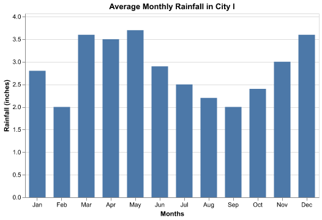

# Part 1 Instructions

You will now begin Part 1 of this survey. In Part 1, you will be shown 14 bar charts, each with a specific question about the underlying data. There will be 7 kinds of questions, with details below. Please answer all questions to the best of your ability. After completing these 14 tasks, Part 2 will contain another short quiz with 12 different data visualizations and a brief demographic questionnaire.

Please read the instructions below before proceding.

## Example Questions

The 7 kinds of questions are detailed below, each referring to this example:
 

## Retrieve Value

This task requires you to retrieve the value associated with a specific bar. For instance:

<strong>Question:</strong> What was the average rainfall in City I in Feb?

<strong>Answer:</strong> 2

## Find Extreme

This task requires you to retrieve either the highest or lowest value. For instance:

<strong>Question:</strong> What was the month with the highest average rainfall in City I?

<strong>Answer:</strong> May

## Determine Range

This task asks you for the range of the data (given by the minimum and maximum values). There will be an input for both Minimum and Maximum. For instance:

<strong>Question:</strong> What is the range of average rainfall in City I?

<strong>Answer:</strong>

<strong>Minimum:</strong> 2

<strong>Maximum:</strong> 3.7

## Make Comparison

This task asks you which bar is larger. For instance:

<strong>Question:</strong> Was the average rainfall higher in Aug or Nov?

<strong>Answer:</strong> Nov

## Filter

This task asks you to select all of the bars that fall within a specific range (inclusive). For instance:

<strong>Question:</strong> Which month(s) had average rainfall between 2.5 and 3 inches (inclusive)?

<strong>Answer:</strong> Jan, Jun, Jul, Nov

## Order

This task asks you to select the order of bars which is either lowest to highest or highest to lowest. For instance:

<strong>Question:</strong> Select the option that orders the months from highest to lowest average rainfall.

<strong>Answer:</strong> May, Mar, Dec, Apr, Nov, Jun, Jan, Jul, Oct, Aug, Feb, Sep

## Ratio

This task asks you for the proportion of one bar to another. In other words, it asks what percentage of one bar's value is given by another bar. For instance:

<strong>Question:</strong> What percentage of the average rainfall in City I from Nov was there in Sep?

<strong>Answer:</strong> 66.7%

